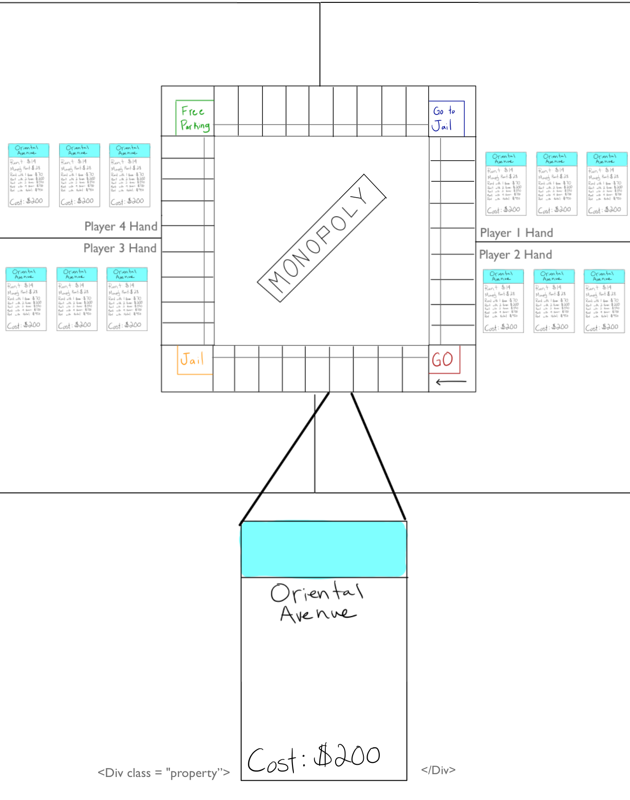
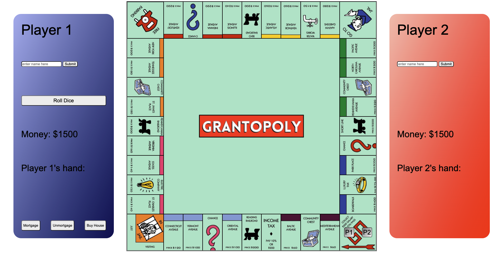

# **Monopoly**

### Grant Menke

### 11/23/2021

#### [GitHub](https://github.com/gmenke54) | [LinkedIn](https://www.linkedin.com/in/grant-menke-b81490223/)

---

A JavaScript Monopoly Clone

---

## **_Description_**

This is a browser-based Monopoly Program written in JavaScript which I coded two weeks after being introduced to HTML, CSS, and JavaScript.

#### [Trello Board](https://trello.com/b/yI0quoOg/monopoly-build)

---

## **_Screenshots_**

Game Board Mock-up:

Final Game Board Screenshot:

---

## **_Technologies_**

- JavaScript
- CSS
- HTML

---

## **_Roadmap (Future Updates)_**

- ~~Write JS OOP to create player classes based on user input~~
- ~~Write JS OOP to create property classes~~
- ~~Write JS for rollDice, movePlayer, and offerToBuy functions~~
- ~~Add a dice display instead of the current alert~~
- Add logic for rolling doubles
- Make house icons appear on the property the user buys them for
- Make it so the user can only buy a house when they have the monopoly
- Add trading functionality
- Add a make auction function
- Add the ability to play with up to 4 players

---

## **_Getting Started_**

1. Press start
2. Enter each player's first name into the corresponding box
3. Player 1 (blue) goes first
4. On your turn:
   - Perform actions (optional)
   - Roll the dice to end your turn
   - Follow the prompts for your roll
5. Take all your friend's money!
6. Just like real life, Grantopoly allows you to go into debt to pay rent or taxes but not to buy houses or unmortgage properties.
7. Be careful! If your total value drops below 0, you lose!

---

## **_Credits_**

**Monopoly Title Image:** [DuckDuckGo](https://duckduckgo.com/?t=hc&va=b)

**Monopoly Tile Images for Gameboard:** [Pixabay](https://pixabay.com/illustrations/monopoly-game-board-game-fun-1984400/)

**Dice Images** [Pixabay](https://pixabay.com/vectors/dice-games-game-six-sided-face-26772/)

**Monopoly Game Logic and Nomenclature:** [Hasbro, Inc.](https://corporate.hasbro.com/en-us)

**Logo Designed Using:** [Canva](https://www.canva.com/)
